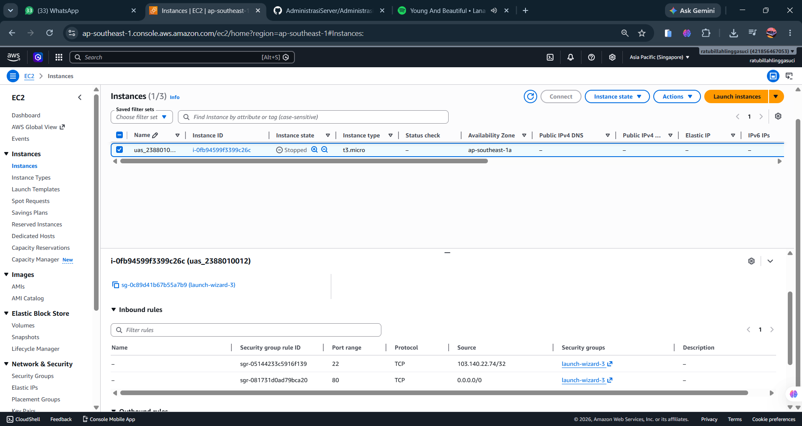
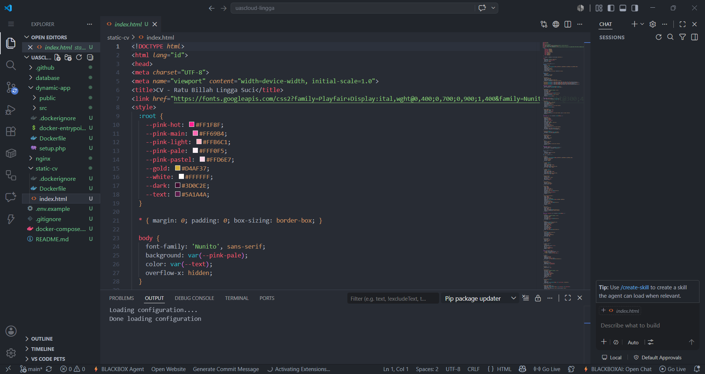
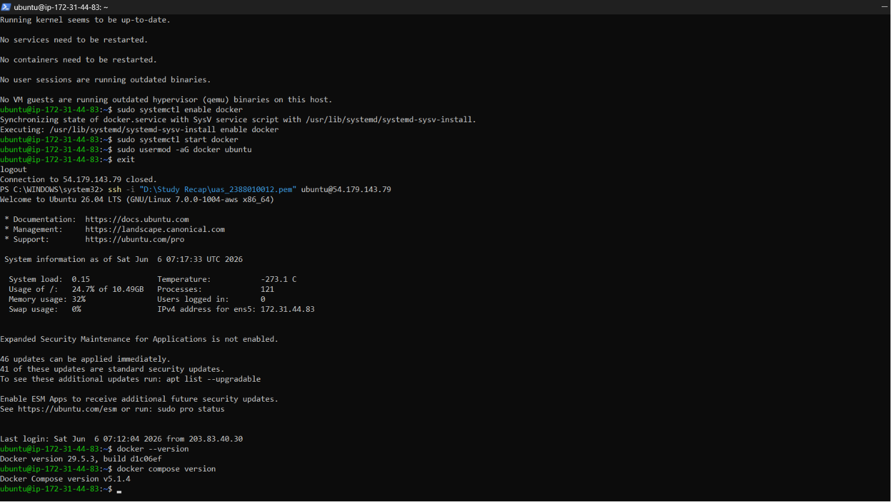
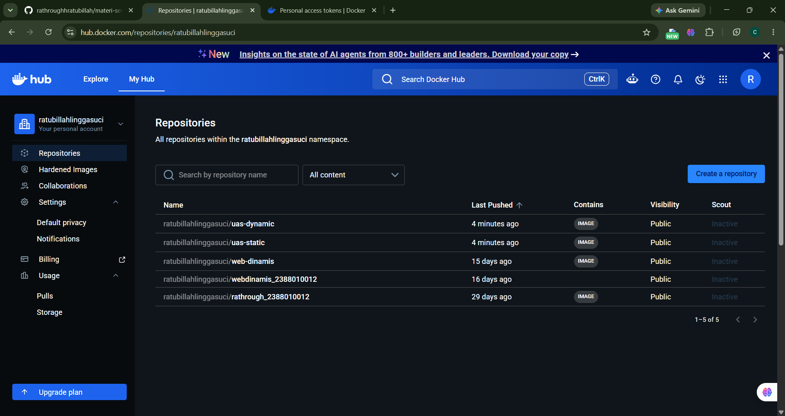
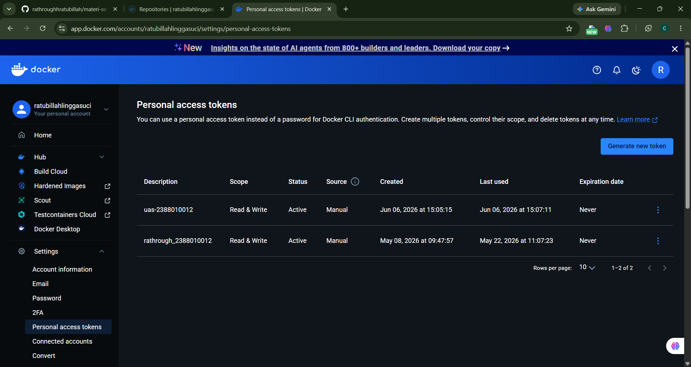
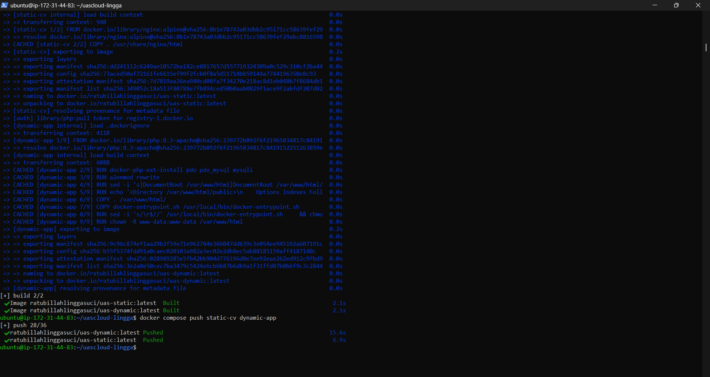
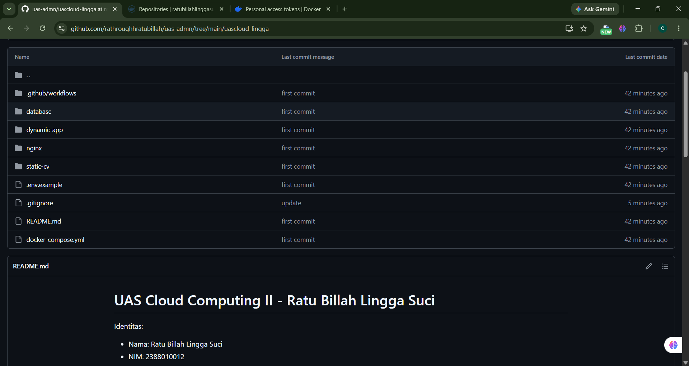
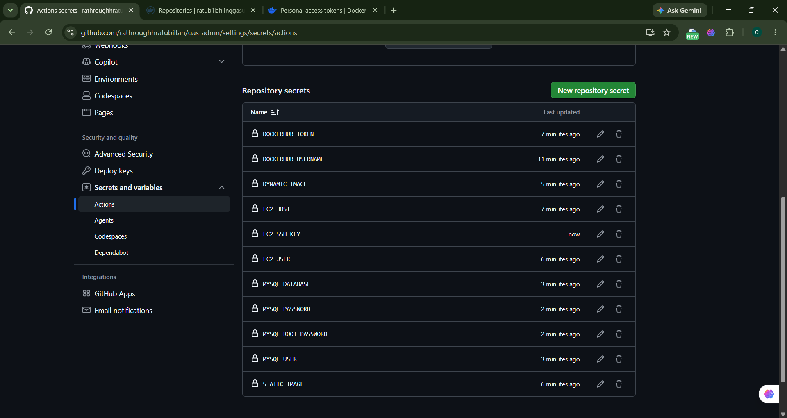
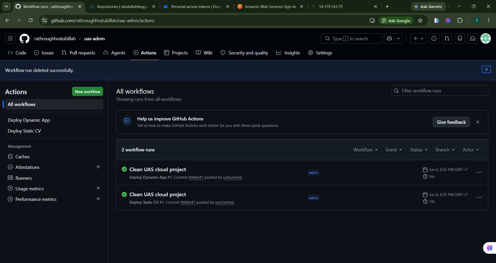
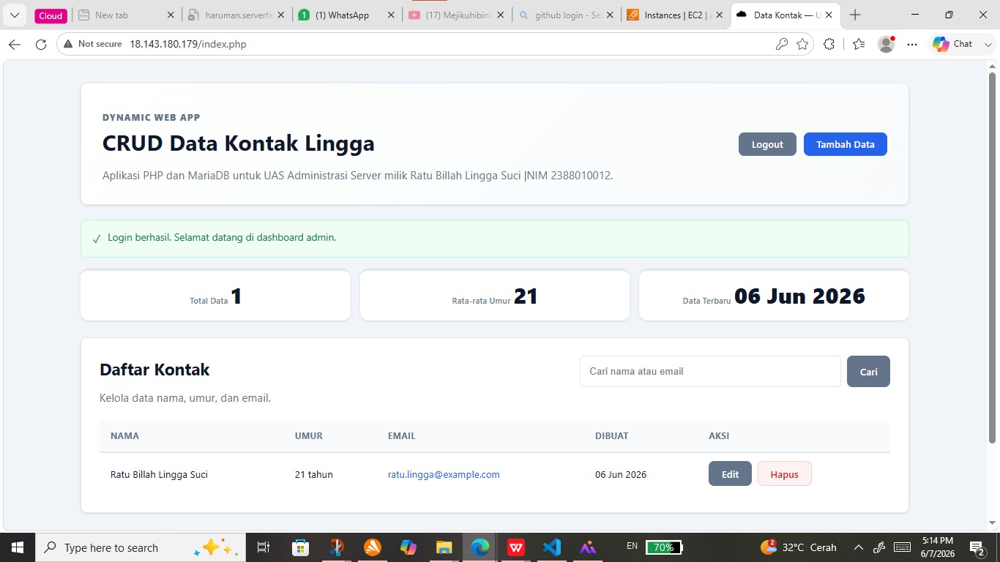

# UAS Administrasi Server : Deploy 2 System Apps Static Web dan Dynamic Web
### 1. Membuat Insteance baru pada AWS Region ap-southeast-1 Singapore

### 2.  Membuat Project UAS Static & Dynamic

### 3. Install Docker dari repository resmi Docker (jalankan dipowershell)
    "sudo apt update"
    "sudo apt install -y ca-certificates curl gnupg"
    "sudo install -m 0755 -d /etc/apt/keyrings"
    "curl -fsSL https://download.docker.com/linux/ubuntu/gpg | sudo gpg --dearmor -o /etc/apt/keyrings/docker.gpg"
    "sudo chmod a+r /etc/apt/keyrings/docker.gpg"
    ". /etc/os-release"
    "echo "deb [arch=$(dpkg --print-architecture) signed-by=/etc/apt/keyrings/docker.gpg] https://download docker.com/linux/ubuntu ${VERSION_CODENAME} stable" | sudo tee /etc/apt/sources.list.d/docker.list > /dev/ null"
    "sudo apt update"
    "sudo apt install -y docker-ce docker-ce-cli containerd.io docker-buildx-plugin docker-compose-plugin"

    LALU AKTIFKAN DOCKER
    "sudo systemctl enable docker"
    "sudo systemctl start docker"
    "sudo usermod -aG docker ubuntu"

    LALU CEK APAKAH DOCKER BERHASIL DIINSTALL
    "docker --version"
    "docker compose version"

### 4. Set Up Docker Hub
    BUAT REPOSITORY BARU PADA DOCKER HUB

    BUAT PERSONAL ACCES TOKEN

### 5. Login Docker ke EC2 Melalui PowerShell
    "docker login -u gamine1"
    (Saat diminta password, paste Docker Hub access token, bukan password akun biasa.)

    BUILD IMAGE DARI PROJECT
    Pastikan Posisi Folder di (cd ~/uas-cloud)
    lalu build "docker compose build static-cv dynamic-app"
    lalu push image ke docker hub "docker compose push static-cv dynamic-app"

### 6. Set Up Github
    Buat Repository Baru di Github - lalu push

### 7. Set Up Secret Github

### 8. Set up Github Action

### 9. Test Statis

### 10. Test Dynamic
