# Membuat Vm /Instance di AWS EC2 Dengan AMI

SEARCH lalu cari EC2 LALU BUKA Menu EC2 keliatan dashboard
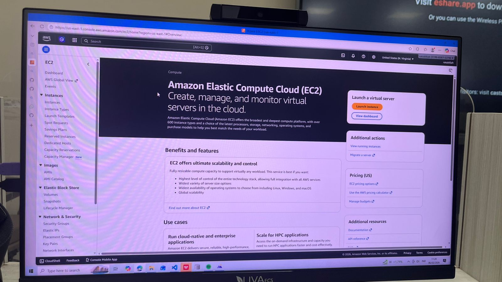

klik menu launch instancee > setting region ke singapur> klik launch instance> isi name di name and tags NIM_server6A> k
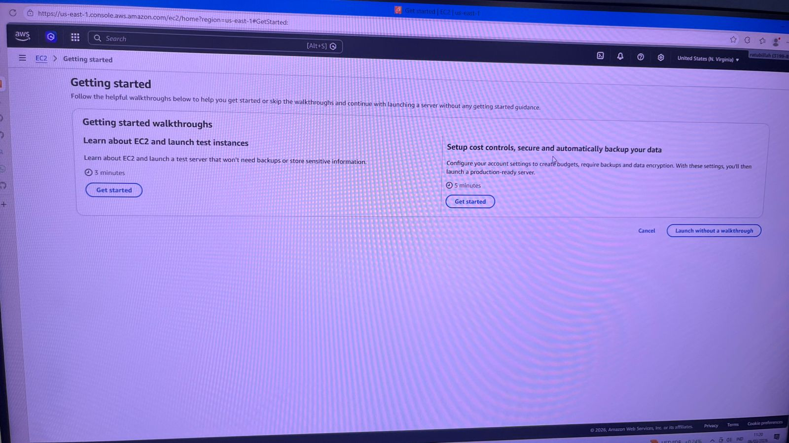
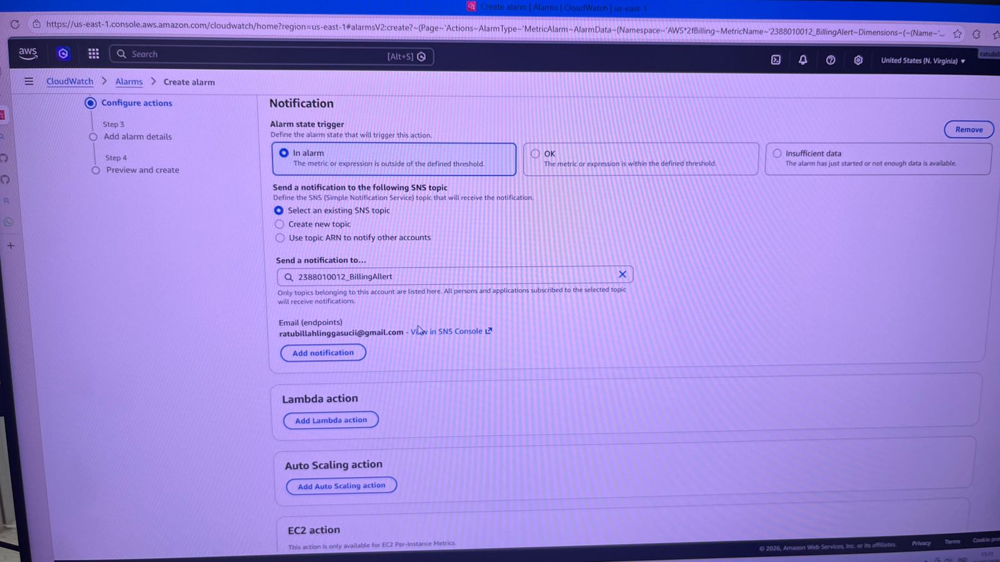

instance type trs search free tier eligible t3.micro
mrmbuat key fair > create new key pair>beri nama NIM_server6A>RSA>.pem>create key pair
nanti kedownload private key pair
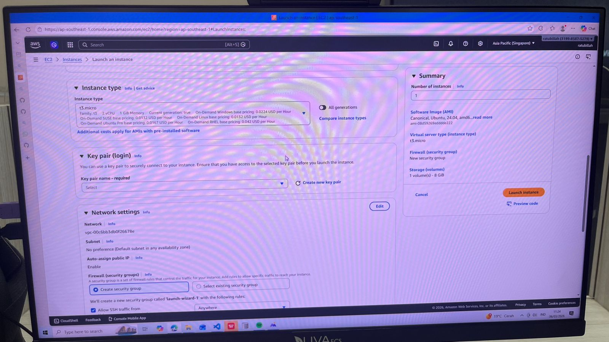
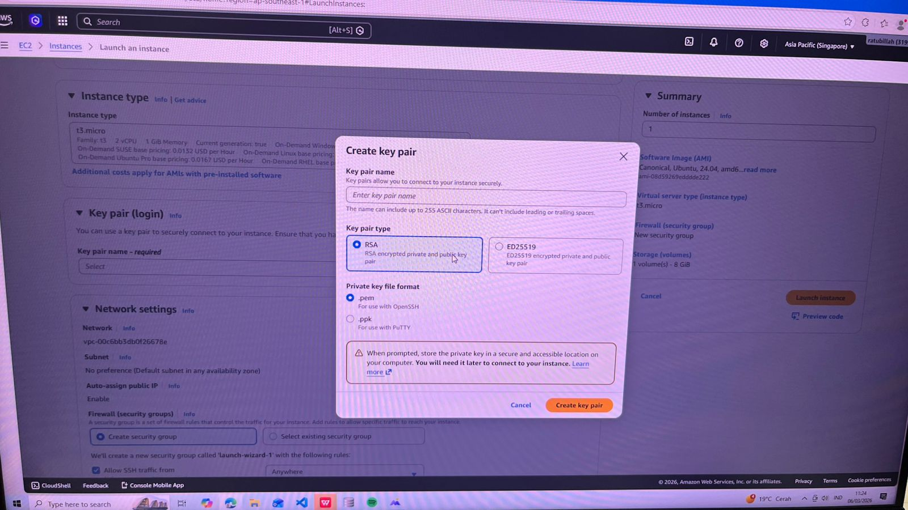
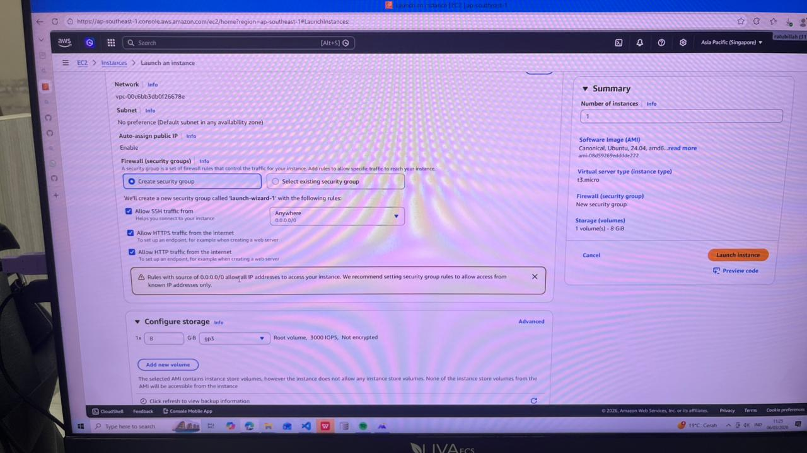
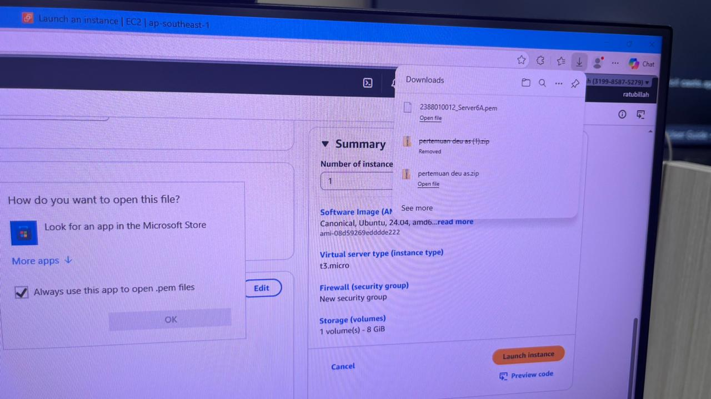

network setting/securoty > create security group>pallow ssh trafic form dan allow semua>pilih anywhereanywhere> storage setting> configure storage > 30gb 9p3

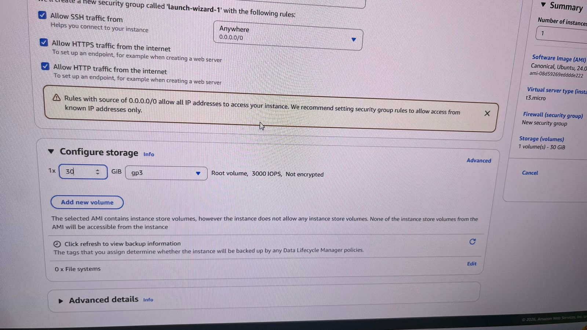
klik launch instance
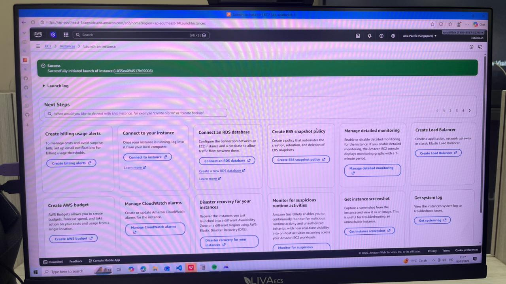
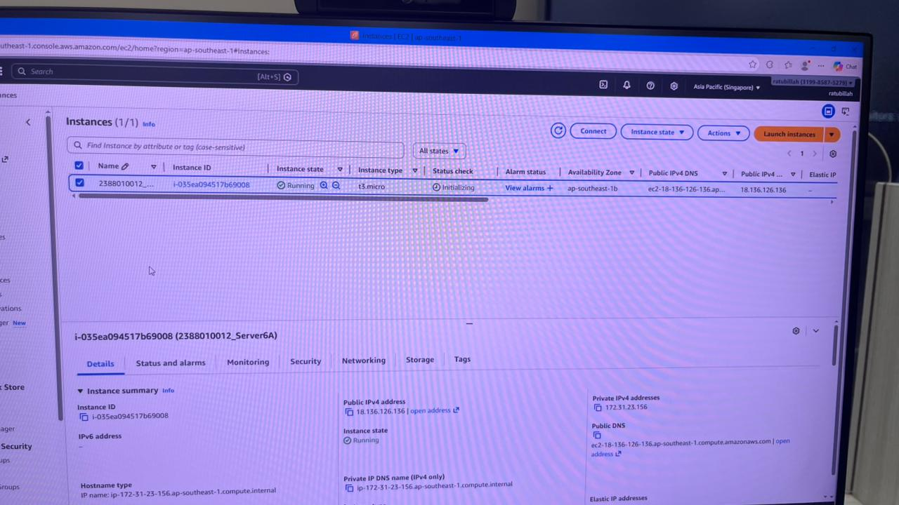
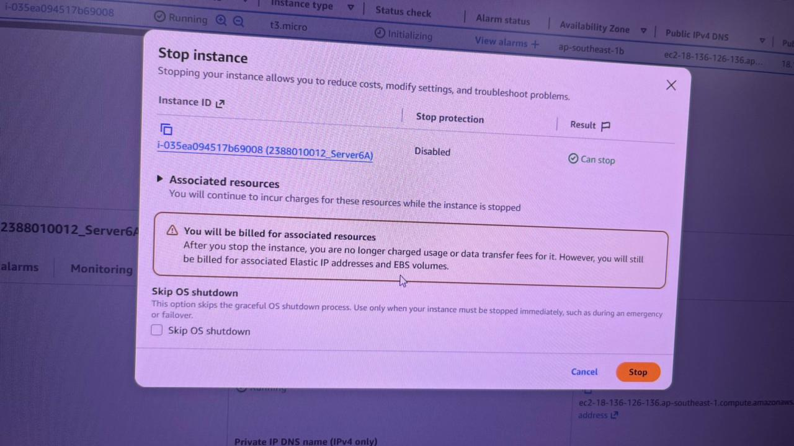