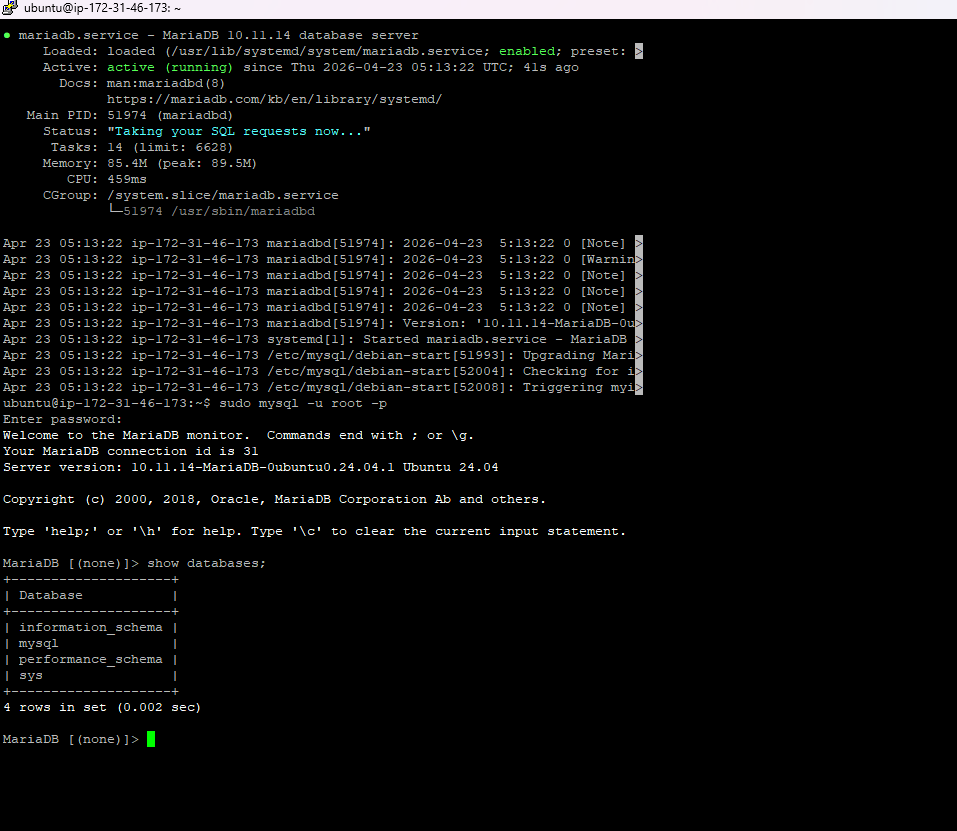
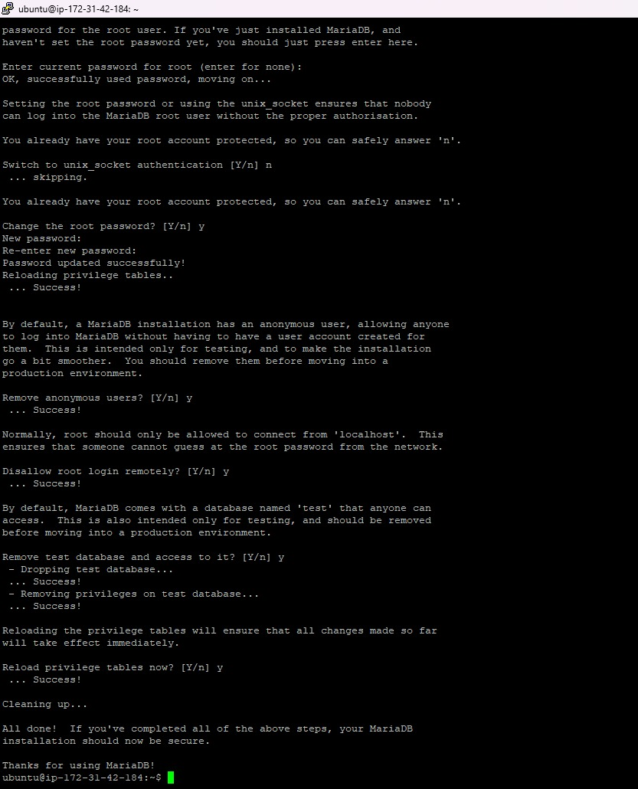

Aktifkan instance EC2
Remote instance menggunakan ssh Powershell dengan format: ssh -i < path-to-key.pem > @IP
Update dan upgrade sistem (sudo apt update && sudo apt upgrade -y)
Install MariaDb (sudo apt install mariadb-server -y)
Cek status MariaDb (sudo systemctl status mariadb)

Test Default Setting database server login sudo mysql -u root -p

Hardening Database Server sudo mysql_secure_installation
Change the password for the root user = Y
Remove anonymous users = Y
Disallow root login remotely = Y
Remove test database and access to it = Y
Reload privilege tables = Y

Reload privilege tables = Y alt text
Create DB untuk Website Company Profile
Login sebagai root

Create DB nama dbcompro_NIM => CREATE DATABASE dbcompro_NIM;

foto

Create User dengan nama = usrcompro_NIM dan password = [PASSWORD] => CREATE USER 'usrcompro_NIM'@'localhost' IDENTIFIED BY '[PASSWORD]'; alt text
Grant user akses ke DB yang baru dibuat => GRANT ALL PRIVILEGES ON dbcompro_NIM.* TO 'usrcompro_NIM'@'localhost';
Flush privileges => FLUSH PRIVILEGES;
exit;
login sebagai usrcompro_NIM dan cek apakah bisa akses ke DB yang baru dibuat

foto
