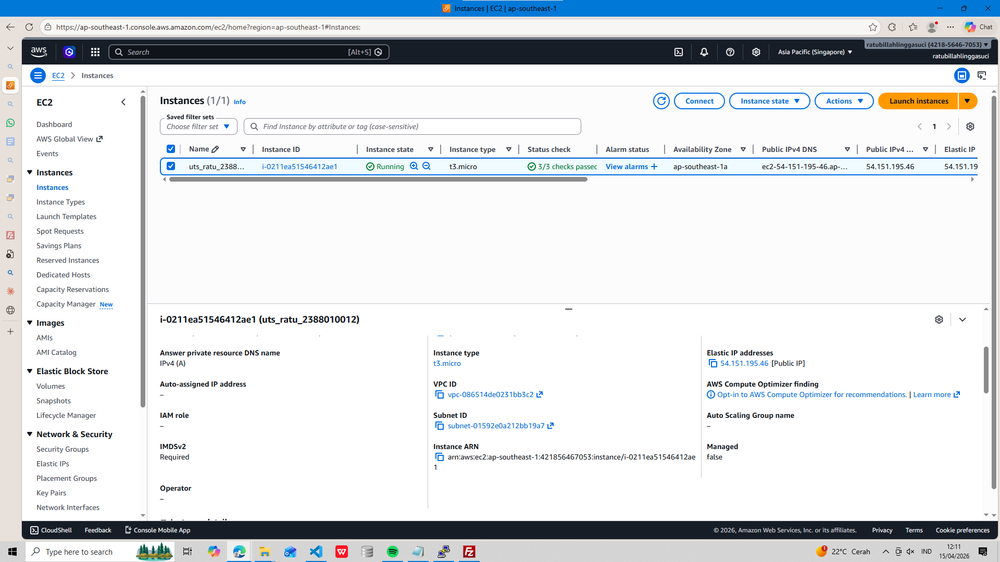
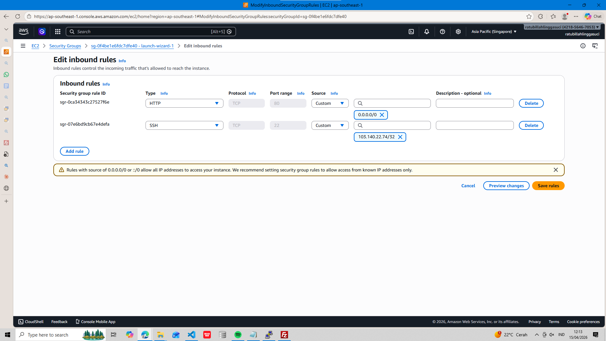
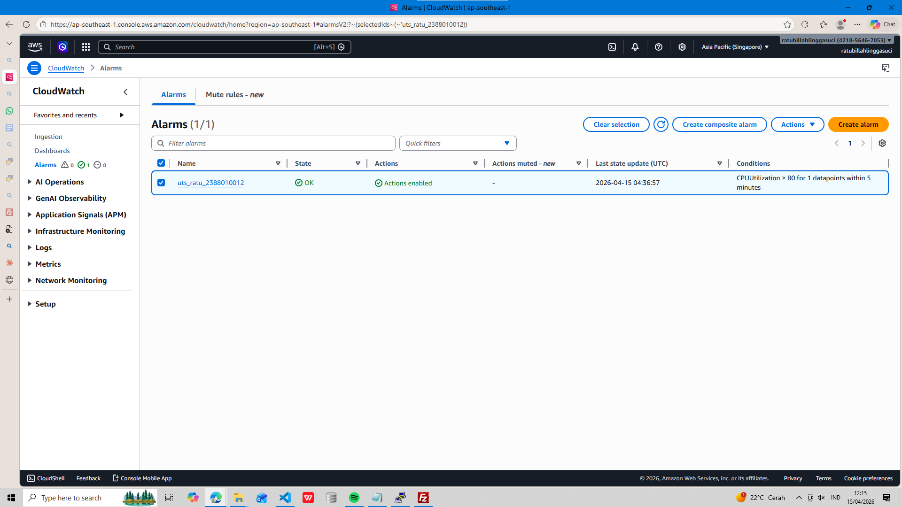
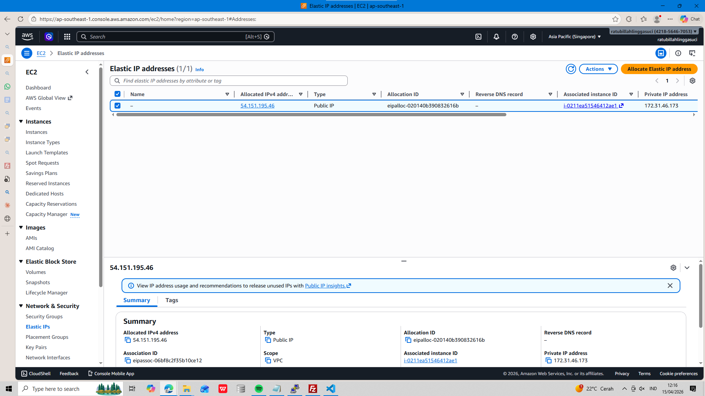
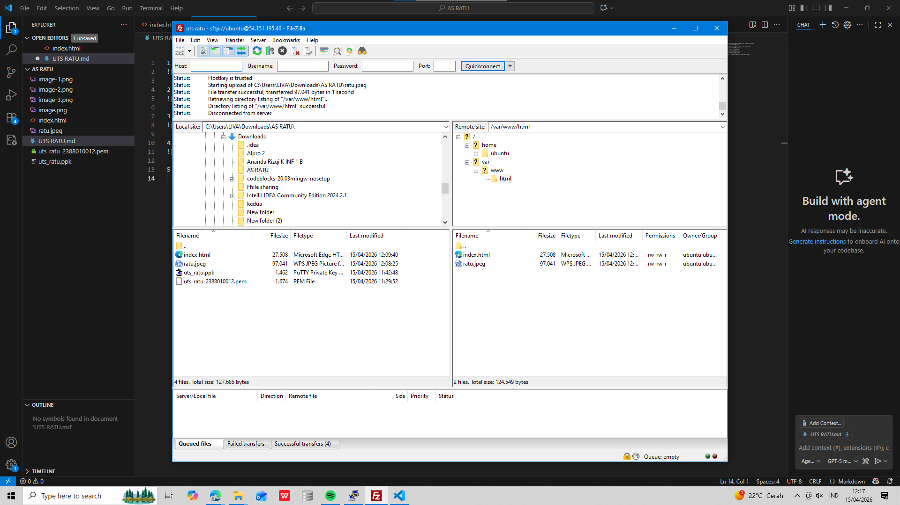
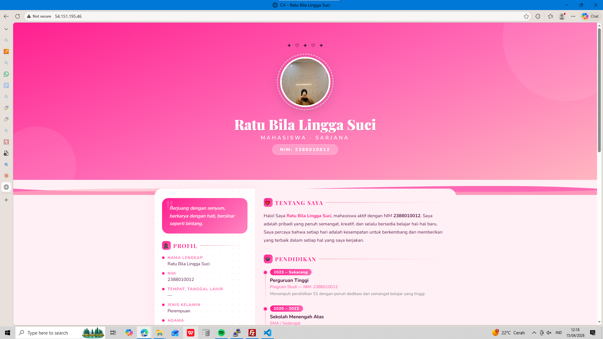

1.chose our region (singapore) and create our instance

2.create our security group in ssh chose my.ip

port 

3.create our cloudwatch

4.create our elastic ips

5.in file zila ssh edit root to ubuntu:ubuntu

6.last create our cv in file (index.html) and upload to ssh

